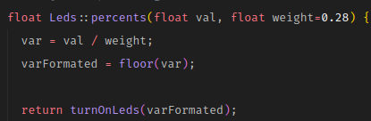
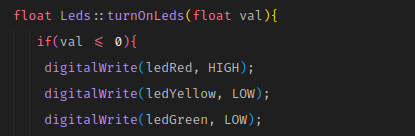

# Documentação:
- [Arquivo Leds.h](#arquivo-ledsh)
- [Arquivo Leds.cpp](#arquivo-ledscpp)
	- [Metodo Begin](#metodo-begin)
	- [Metodo Percents](#metodo-percents)
	- [Metodo turnOnLeds](#metodo-turnonleds)
- [Arquivo keywords.txt](#arquivo-keywordstxt)
- [Como instalar sua própria library/biblioteca](#como-instalar-sua-própria-librarybiblioteca)
	- [linux](#linux)
	- [windows](#windows)
________________________________________________________________

## Arquivo Leds.h
	Arquivo responsável pelas interfaces do Arquivo Leds.cpp
	As interfacesE seria a abstração da classe.

________________________________________________________________
## Arquivo Leds.cpp
	Arquivo responsável pela logica do programa.

### Metodo Begin


- **valR, valG e valY** são os parâmetros responsáveis por definir 
as portas(digitais) que irá acender as leds(semáforo).

- Faz referência a novas variáveis **ledGreen, ledYellow e ledRed**
para melhor identificação das variáveis.
________________________________________________________________
### Metodo Percents


- variável **val** irá receber valor da celula da balança.

- variável **weight** irá receber o peso máximo em porcentagem.

A botija de 13kg(vazia) + 15(o gas) = 28kg;

14kg --> valor recebido pela balança(suposição),
para jorgarmos esse valor para porcentagem, se faz um calculo

de ***regra de 3***. 

```cpp
 var = val / weight;
```
e para arrendondar para baixo:
```cpp
varFormated = floor(var);
```

28kg ------- 100%

14kg ------- X

e por ultimo joga dentro da função turnOnLeds(responsável por ligar
a led(semáforo) conforme a porcentagem).

[Dados para botija](https://brainly.com.br/tarefa/10255772)

[quanto pesa um botijao de gas vazio](https://www.precodogas.com.br/quanto-pesa-um-botijao-de-gas-vazio.php)
________________________________________________________________
### Metodo turnOnLeds


- variável **val** irá receber a porcentagem de **percents** e atráves
dessa porcentagem irá determinar qual led(semáfaro) ligar.

```cpp
//ligar led
digitalWrite(ledRed, HIGH);

//desligar led
digitalWrite(ledRed, LOW);
```

________________________________________________________________

## Arquivo keywords.txt
	Este txt será responsável para que o arduino entenda o que é 
	classe e o que é metodo.
	E a classificação fica dessa forma:
		Classe --> KEYWORD1
		Metodo --> KEYWORD2
________________________________________________________________

## Como instalar sua própria library/biblioteca
	Pega os 3 arquivos citados acima, coloca dentro de uma pasta do mesmo nome, 
	por exemplo: Leds
	Em seguida, encontre o diretorio da pasta Arduino e encontre o diretorio libraries.

### linux:


### Windows:
 <code>C:\Users\Seu User\Documents\Arduino\libraries</code>
