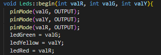
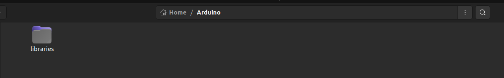

# Documentação:
________________________________________________________________

## Arquivo Leds.h
	Arquivo responsável pelas interfaces do Arquivo Leds.cpp
	As interfacesE seria a abstração da classe.

________________________________________________________________
## Arquivo Leds.cpp
	Arquivo responsável pela logica do programa.

### Metodo Begin

**valR, valG e valY** são os parâmetros responsáveis por definir 

as portas(digitais) que irá acender as leds(semáforo).

Fiz referência a novas variáveis **ledGreen, ledYellow e ledRed**

para melhor identificação das variáveis.
________________________________________________________________

## Arquivo keywords.txt
	Este txt será responsável para que o arduino entenda o que é 
	classe e o que é metodo.
	E a classificação fica dessa forma:
		Classe --> KEYWORD1
		Metodo --> KEYWORD2
________________________________________________________________

## Como instalar sua própria library/biblioteca
	Pega os 3 arquivos citados acima, coloca dentro de uma pasta do mesmo nome, 
	por exemplo: Leds
	Em seguida, encontre o diretorio da pasta Arduino e encontre o diretorio libraries.

### linux:

### Windows:
 <code>C:\Users\Seu User\Documents\Arduino\libraries</code>